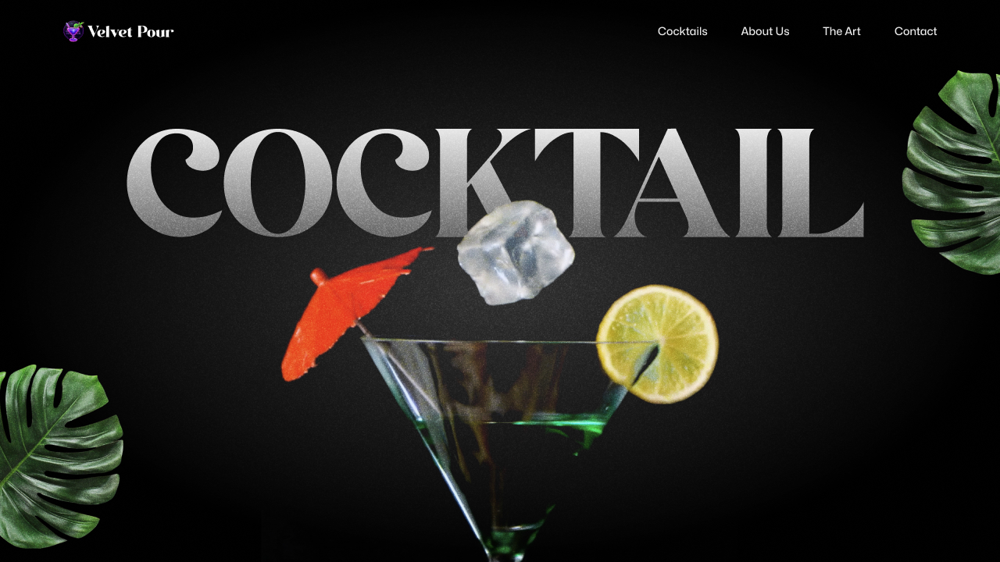

# 🍹 Mocktail & Cocktail Website

A modern, visually engaging mockup website for selling mocktails and cocktails.  
Built with **React**, **TailwindCSS**, and **GSAP** for smooth web animations and an immersive user experience.  



---

## ✨ Features

- Responsive and mobile-friendly design  
- Smooth and interactive animations powered by **GSAP**  
- Styled with **TailwindCSS** for clean and customizable UI  
- Component-driven architecture with **React**  
- Perfect for demonstrating modern web development practices  

---

## 🚀 Tech Stack

- **React** – Component-based UI development  
- **TailwindCSS** – Utility-first styling  
- **GSAP** – High-performance animations  
- **JavaScript (ES6+)** – Core programming language  

---

## 📸 Demo Preview

> [Live Demo](https://neon-cocktail.vercel.app)

---

## ⚙️ Installation & Setup

Clone the repository and install dependencies:

```bash
git clone https://github.com/your-username/mocktail-cocktail-website.git
cd mocktail-cocktail-website
npm install
```

```bash
npm start
```

